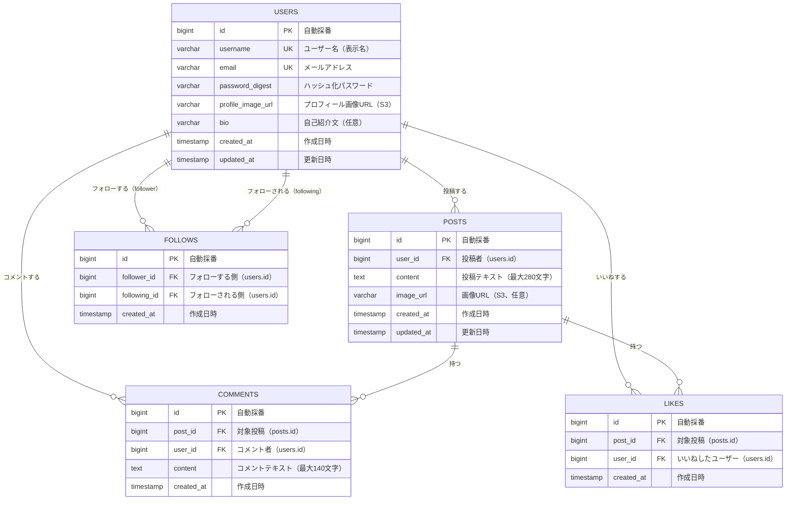

# データベース設計書

関連: [要件定義書](requirements.md) / [機能要件書](functional-requirements.md)

## 0. ER図とは（学習用メモ）

| 用語 | 意味 | 例 |
| --- | --- | --- |
| エンティティ | データの「もの」 | ユーザー、投稿、コメント |
| 属性 | エンティティの「特徴」 | ユーザーのメールアドレス、投稿のテキスト |
| リレーション | エンティティ間の「関係」 | ユーザーは投稿を持つ（1対多） |
| PK | 主キー。テーブル内で一意の識別子 | users.id |
| FK | 外部キー。他テーブルのPKを参照 | posts.user_id → users.id |
| UK | ユニーク制約。重複禁止 | users.email |

---

## 1. エンティティ一覧

| エンティティ | テーブル名 | 役割 |
| --- | --- | --- |
| ユーザー | users | アプリの利用者を管理する |
| 投稿 | posts | ユーザーが作成したテキスト・画像の投稿 |
| コメント | comments | 投稿に対するコメント |
| いいね | likes | ユーザーが投稿につけたいいね |
| フォロー | follows | ユーザー間のフォロー/フォロワー関係 |

---

## 2. ER図（Mermaid）

---

## 3. テーブル定義

### 3.1 users（ユーザー）

| カラム | 型 | NULL | キー | デフォルト | 説明 |
| --- | --- | --- | --- | --- | --- |
| id | BIGINT | NOT NULL | PK | 自動採番 | ユーザーID |
| username | VARCHAR(50) | NOT NULL | UK | - | ユーザー名（表示名） |
| email | VARCHAR(255) | NOT NULL | UK | - | メールアドレス |
| password_digest | VARCHAR(255) | NOT NULL | - | - | Bcryptハッシュ化パスワード |
| profile_image_url | VARCHAR(1000) | NULL | - | NULL | プロフィール画像URL（S3） |
| bio | VARCHAR(160) | NULL | - | NULL | 自己紹介文 |
| created_at | TIMESTAMP | NOT NULL | - | CURRENT_TIMESTAMP | 作成日時 |
| updated_at | TIMESTAMP | NOT NULL | - | CURRENT_TIMESTAMP | 更新日時 |

### 3.2 posts（投稿）

| カラム | 型 | NULL | キー | デフォルト | 説明 |
| --- | --- | --- | --- | --- | --- |
| id | BIGINT | NOT NULL | PK | 自動採番 | 投稿ID |
| user_id | BIGINT | NOT NULL | FK | - | 投稿者（users.id） |
| content | TEXT | NOT NULL | - | - | 投稿テキスト（最大280文字） |
| image_url | VARCHAR(1000) | NULL | - | NULL | 画像URL（S3、任意） |
| created_at | TIMESTAMP | NOT NULL | - | CURRENT_TIMESTAMP | 作成日時 |
| updated_at | TIMESTAMP | NOT NULL | - | CURRENT_TIMESTAMP | 更新日時 |

### 3.3 comments（コメント）

| カラム | 型 | NULL | キー | デフォルト | 説明 |
| --- | --- | --- | --- | --- | --- |
| id | BIGINT | NOT NULL | PK | 自動採番 | コメントID |
| post_id | BIGINT | NOT NULL | FK | - | 対象投稿（posts.id） |
| user_id | BIGINT | NOT NULL | FK | - | コメント者（users.id） |
| content | TEXT | NOT NULL | - | - | コメントテキスト（最大140文字） |
| created_at | TIMESTAMP | NOT NULL | - | CURRENT_TIMESTAMP | 作成日時 |

### 3.4 likes（いいね）

| カラム | 型 | NULL | キー | デフォルト | 説明 |
| --- | --- | --- | --- | --- | --- |
| id | BIGINT | NOT NULL | PK | 自動採番 | いいねID |
| post_id | BIGINT | NOT NULL | FK | - | 対象投稿（posts.id） |
| user_id | BIGINT | NOT NULL | FK | - | いいねしたユーザー（users.id） |
| created_at | TIMESTAMP | NOT NULL | - | CURRENT_TIMESTAMP | 作成日時 |

### 3.5 follows（フォロー）

| カラム | 型 | NULL | キー | デフォルト | 説明 |
| --- | --- | --- | --- | --- | --- |
| id | BIGINT | NOT NULL | PK | 自動採番 | フォローID |
| follower_id | BIGINT | NOT NULL | FK | - | フォローする側（users.id） |
| following_id | BIGINT | NOT NULL | FK | - | フォローされる側（users.id） |
| created_at | TIMESTAMP | NOT NULL | - | CURRENT_TIMESTAMP | 作成日時 |

---

## 4. インデックス

| テーブル | インデックス名 | カラム | 種別 | 目的 |
| --- | --- | --- | --- | --- |
| users | idx_users_email | email | UNIQUE | ログイン時のメール検索 |
| users | idx_users_username | username | UNIQUE | ユーザー検索・一意性保証 |
| posts | idx_posts_user_id | user_id | INDEX | ユーザーの投稿一覧取得 |
| posts | idx_posts_created_at | created_at DESC | INDEX | タイムライン新着順取得 |
| comments | idx_comments_post_id | post_id | INDEX | 投稿のコメント一覧取得 |
| comments | idx_comments_user_id | user_id | INDEX | ユーザーのコメント一覧取得 |
| comments | idx_comments_post_order | (post_id, created_at ASC) | INDEX | コメント昇順取得の高速化 |
| likes | idx_likes_post_id | post_id | INDEX | 投稿のいいね数集計 |
| likes | idx_likes_user_id | user_id | INDEX | ユーザーのいいね一覧取得 |
| likes | uq_likes_post_user | (post_id, user_id) | UNIQUE | 同一ユーザーの重複いいね防止 |
| follows | uq_follows_follower_following | (follower_id, following_id) | UNIQUE | 重複フォロー防止 |
| follows | idx_follows_follower_id | follower_id | INDEX | フォロー中一覧取得 |
| follows | idx_follows_following_id | following_id | INDEX | フォロワー一覧取得 |

---

## 5. 制約

### NOT NULL 制約

- すべてのID（PK, FK）は NOT NULL
- users.username, users.email, users.password_digest は NOT NULL
- posts.content, comments.content は NOT NULL

### UNIQUE 制約

- users.email: メールアドレスの重複登録禁止
- users.username: ユーザー名の重複禁止
- likes(post_id, user_id): 同一ユーザーによる同一投稿への重複いいね禁止
- follows(follower_id, following_id): 同一ユーザーによる同一ユーザーへの重複フォロー禁止

### 外部キー制約（ON DELETE CASCADE）

- posts.user_id → users.id: ユーザー削除時に投稿も削除
- comments.post_id → posts.id: 投稿削除時にコメントも削除
- comments.user_id → users.id: ユーザー削除時にコメントも削除
- likes.post_id → posts.id: 投稿削除時にいいねも削除
- likes.user_id → users.id: ユーザー削除時にいいねも削除
- follows.follower_id → users.id: ユーザー削除時にフォロー関係も削除
- follows.following_id → users.id: ユーザー削除時にフォロー関係も削除

### CHECK 制約

- posts.content: LENGTH(content) <= 280（DB 制約）
- comments.content: LENGTH(content) >= 1（DB 制約）。上限 140 文字はアプリ側バリデーション（`@Size(max=140)`）で管理
- follows: follower_id ≠ following_id（自分自身をフォロー禁止）

---

## 6. 将来の拡張（スコープ外）

- `notifications` テーブル: いいね・コメント・フォロー時の通知管理
- `hashtags` / `post_hashtags` テーブル: ハッシュタグ機能
- `direct_messages` テーブル: DM機能
