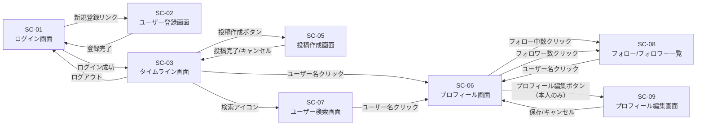

# 画面設計書

関連: [要件定義書](requirements.md) / [機能要件書](functional-requirements.md)

## 1. 画面一覧

| 画面ID | 画面名 | 概要 | 関連機能 | 実装状況 |
| --- | --- | --- | --- | --- |
| SC-01 | ログイン画面 | メールアドレス・パスワードでログイン | F-01 | ✅ 実装済み（`/login`） |
| SC-02 | ユーザー登録画面 | 新規ユーザー登録フォーム | F-01 | ✅ 実装済み（`/register`） |
| SC-03 | タイムライン画面 | 全ユーザーの投稿を新着順に表示 | F-02, F-03, F-04, F-05 | ✅ 実装済み（`/home`、SSE・無限スクロール・フォロー中フィルター含む） |
| SC-04 | 投稿詳細画面 | 投稿の詳細・コメント一覧・いいね | F-02, F-03, F-04, F-05 | ⚠️ 設計変更（独立ページなし、コメントは PostCard 内インライン表示） |
| SC-05 | 投稿作成画面 | テキスト・画像の投稿作成フォーム | F-02, F-05 | ✅ 実装済み（タイムライン画面内フォーム、独立ページなし） |
| SC-06 | プロフィール画面 | ユーザーの投稿一覧・フォロー情報 | F-02, F-06 | ✅ 実装済み（`/profile/[userId]`、編集: `/profile/edit`） |
| SC-07 | ユーザー検索画面 | ユーザー名で検索・フォロー操作 | F-06 | ✅ 実装済み（`/search`） |
| SC-08 | フォロー/フォロワー一覧画面 | フォロー中・フォロワーのユーザー一覧 | F-06 | ✅ 実装済み（`/profile/[userId]/follows`） |
| SC-09 | プロフィール編集画面 | 自分のプロフィール情報・画像の編集 | F-01, F-05 | ✅ 実装済み（`/profile/edit`） |

---

## 2. 画面遷移図



---

## 3. ワイヤーフレーム（簡易）

### SC-01 ログイン画面

```text
┌────────────────────────────────┐
│         RaiseTimeLine          │
├────────────────────────────────┤
│  Email    : [______________]   │
│  Password : [______________]   │
│            [   ログイン   ]    │
│                                │
│   アカウントをお持ちでない方   │
│   → 新規登録はこちら           │
└────────────────────────────────┘
```

### SC-02 ユーザー登録画面

```text
┌────────────────────────────────┐
│         新規ユーザー登録       │
├────────────────────────────────┤
│  ユーザー名 : [____________]   │
│  Email      : [____________]   │
│  Password   : [____________]   │
│              [   登録する   ]  │
│                                │
│   すでにアカウントをお持ちの方 │
│   → ログイン画面へ             │
└────────────────────────────────┘
```

### SC-03 タイムライン画面

```text
┌──────────────────────────────────────────────┐
│ RaiseTimeLine  [🔍 検索]  [ユーザー名▼]     │
├──────────────────────────────────────────────┤
│  [ + 投稿する ]                              │
├──────────────────────────────────────────────┤
│ ┌──────────────────────────────────────────┐ │
│ │ 👤 ユーザーA  ·  2分前                  │ │
│ │ 投稿テキストがここに表示されます。       │ │
│ │ [添付画像があれば表示]                   │ │
│ │ ❤️ 12  💬 3                 [削除(本人)] │ │
│ └──────────────────────────────────────────┘ │
│ ┌──────────────────────────────────────────┐ │
│ │ 👤 ユーザーB  ·  15分前                 │ │
│ │ 別の投稿テキストがここに表示されます。   │ │
│ │ ❤️ 5   💬 1                              │ │
│ └──────────────────────────────────────────┘ │
└──────────────────────────────────────────────┘
```

### SC-04 投稿詳細画面

```text
┌──────────────────────────────────────────────┐
│ ← 戻る                                       │
├──────────────────────────────────────────────┤
│ 👤 ユーザーA  ·  2026-05-04 10:00            │
│ 投稿テキストがここに表示されます。           │
│ [添付画像があれば表示]                       │
│ ❤️ 12  💬 3   [いいね解除/いいねする]       │
├──────────────────────────────────────────────┤
│ コメント一覧                                 │
│ ┌──────────────────────────────────────────┐ │
│ │ 👤 ユーザーB  ·  2026-05-04 10:05       │ │
│ │ コメントテキスト          [削除(本人)]   │ │
│ └──────────────────────────────────────────┘ │
├──────────────────────────────────────────────┤
│ コメントを入力:  [________________________]  │
│                  [  コメントを投稿する  ]    │
└──────────────────────────────────────────────┘
```

### SC-05 投稿作成画面

```text
┌──────────────────────────────────────────────┐
│ 新規投稿                           [× 閉じる] │
├──────────────────────────────────────────────┤
│ 👤 ユーザーA                                 │
│ ┌──────────────────────────────────────────┐ │
│ │ 今、何してる？ (最大280文字)              │ │
│ │                                          │ │
│ └──────────────────────────────────────────┘ │
│ 残り: 280文字                                │
│ [🖼️ 画像を追加]                             │
│ [プレビュー画像があれば表示]                 │
│                    [ 投稿する ]              │
└──────────────────────────────────────────────┘
```

### SC-06 プロフィール画面

```text
┌──────────────────────────────────────────────┐
│ RaiseTimeLine  [🔍 検索]  [ユーザー名▼]     │
├──────────────────────────────────────────────┤
│ [プロフィール画像]                           │
│ ユーザーA                                   │
│ フォロー中: 42  フォロワー: 128             │
│                   [ フォローする / フォロー中 ]│
├──────────────────────────────────────────────┤
│ 投稿一覧                                     │
│ ┌──────────────────────────────────────────┐ │
│ │ 2026-05-04  投稿テキスト...              │ │
│ │ ❤️ 12  💬 3                              │ │
│ └──────────────────────────────────────────┘ │
└──────────────────────────────────────────────┘
```

### SC-07 ユーザー検索画面

```text
┌──────────────────────────────────────────────┐
│ RaiseTimeLine  [🔍 検索]  [ユーザー名▼]     │
├──────────────────────────────────────────────┤
│ ユーザーを検索:  [______________] [検索する] │
├──────────────────────────────────────────────┤
│ 検索結果                                     │
│ ┌──────────────────────────────────────────┐ │
│ │ 👤 ユーザーA          [ フォローする ]   │ │
│ └──────────────────────────────────────────┘ │
│ ┌──────────────────────────────────────────┐ │
│ │ 👤 ユーザーB          [ フォロー中 ]    │ │
│ └──────────────────────────────────────────┘ │
└──────────────────────────────────────────────┘
```

### SC-08 フォロー/フォロワー一覧画面

```text
┌──────────────────────────────────────────────┐
│ ← 戻る          フォロー中 / フォロワー      │
├──────────────────────────────────────────────┤
│ [フォロー中] [フォロワー]  ← タブ切り替え   │
├──────────────────────────────────────────────┤
│ ┌──────────────────────────────────────────┐ │
│ │ 👤 ユーザーA          [ フォロー中 ]    │ │
│ └──────────────────────────────────────────┘ │
│ ┌──────────────────────────────────────────┐ │
│ │ 👤 ユーザーB          [ フォローする ]   │ │
│ └──────────────────────────────────────────┘ │
└──────────────────────────────────────────────┘
```

---

## 4. 画面要件

### SC-01 要件（ログイン画面）

| 項目 | 要件 |
| --- | --- |
| 表示項目 | アプリタイトル、メール入力、パスワード入力、ログインボタン、新規登録リンク |
| 入力バリデーション | 必須入力チェック・メール形式チェック |
| エラー表示 | 認証失敗時にフォーム下部にメッセージ表示 |
| 遷移 | ログイン成功→SC-03 / 新規登録リンク→SC-02 |

### SC-02 要件（ユーザー登録画面）

| 項目 | 要件 |
| --- | --- |
| 表示項目 | ユーザー名・メール・パスワード入力、登録ボタン、ログイン画面へのリンク |
| 入力バリデーション | メール形式・一意性 / ユーザー名一意性 / パスワード8文字以上・英数字混在 |
| エラー表示 | 項目ごとにフィールド下部にエラーメッセージを表示 |
| 遷移 | 登録成功→SC-01 / ログインリンク→SC-01 |

### SC-03 要件（タイムライン画面）

| 項目 | 要件 |
| --- | --- |
| 表示項目 | ナビゲーションバー（検索・ユーザーメニュー）、投稿作成ボタン、投稿カード一覧 |
| 投稿カード | ユーザー名・投稿テキスト・画像（任意）・いいね数・コメント数・投稿日時（相対表示） |
| 表示順 | 全ユーザーの投稿を新着順（created_at 降順） |
| 操作 | 投稿作成→SC-05 / ユーザー名クリック→SC-06 / 検索→SC-07 |
| 削除 | 自分の投稿のみ削除ボタンを表示。確認ダイアログ後に削除 |

### SC-04（投稿詳細画面）— 設計変更

> ⚠️ **設計変更**: 独立した投稿詳細ページは実装しないことに変更。
> コメント一覧・コメント投稿・いいね操作はすべて SC-03 タイムライン画面内の `PostCard` コンポーネントにインライン実装した。
> これにより画面遷移が不要になり、UX がよりスムーズになった。

### SC-05 要件（投稿作成画面）

| 項目 | 要件 |
| --- | --- |
| 表示項目 | テキスト入力エリア（残り文字数表示）、画像追加ボタン、画像プレビュー、投稿ボタン |
| 入力バリデーション | テキスト必須・最大280文字 / 画像は5MB以下・JPEG/PNG/GIFのみ |
| エラー表示 | バリデーションエラーはフォーム内に即時表示 |
| 遷移 | 投稿成功→SC-03 / キャンセル→SC-03 |

### SC-06 要件（プロフィール画面）

| 項目 | 要件 |
| --- | --- |
| 表示項目 | プロフィール画像・ユーザー名・フォロー中数・フォロワー数・フォローボタン・投稿一覧 |
| フォローボタン | 自分のプロフィールには非表示。他ユーザーの場合はフォロー状態に応じて切り替え |
| 投稿一覧 | そのユーザーの投稿のみ新着順で表示 |
| 遷移 | フォロー中数クリック→SC-08（フォロー中タブ）/ フォロワー数クリック→SC-08（フォロワータブ） |

### SC-07 要件（ユーザー検索画面）

| 項目 | 要件 |
| --- | --- |
| 表示項目 | 検索入力フォーム、検索ボタン、検索結果一覧 |
| 検索方法 | ユーザー名の部分一致検索 |
| 検索結果 | ユーザー名・フォローボタン（自分自身は非表示）を表示 |
| 遷移 | ユーザー名クリック→SC-06 |

### SC-08 要件（フォロー/フォロワー一覧画面）

| 項目 | 要件 |
| --- | --- |
| 表示項目 | フォロー中/フォロワーのタブ、ユーザー一覧（ユーザー名・フォローボタン） |
| タブ切り替え | フォロー中一覧とフォロワー一覧を切り替え |
| フォローボタン | 自分自身は非表示。フォロー状態に応じて「フォローする/フォロー中」を切り替え |
| 遷移 | ユーザー名クリック→SC-06 / 戻る→SC-06 |

### SC-09 要件（プロフィール編集画面）

| 項目 | 要件 |
| --- | --- |
| 表示項目 | プロフィール画像・ユーザー名・bio（自己紹介）の編集フォーム |
| アクセス制御 | ログイン済みユーザーが自分自身のプロフィールのみ編集可能 |
| 画像アップロード | JPEG/PNG/GIF、5MB 以下。選択後プレビュー表示。AWS S3 へ保存 |
| 入力バリデーション | ユーザー名必須・一意性 / bio は160文字以内 |
| エラー表示 | 項目ごとにフィールド下部にエラーメッセージを表示 |
| 遷移 | 保存成功→SC-06（自分のプロフィール） / キャンセル→SC-06 |
